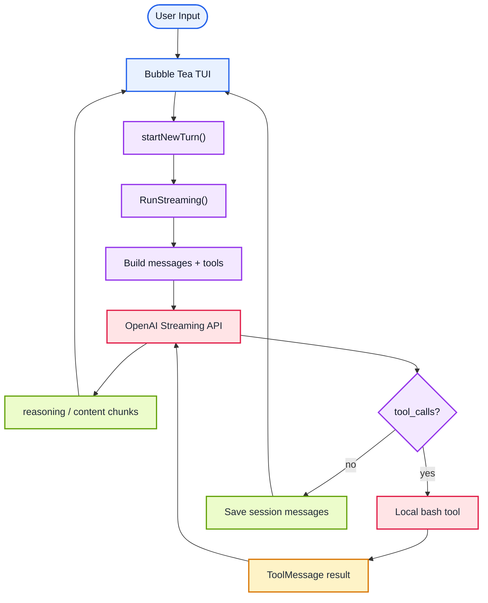

```mermaid
flowchart TD
    classDef entry fill:#e8f1ff,stroke:#2563eb,stroke-width:2px,color:#0f172a;
    classDef orchestration fill:#f3e8ff,stroke:#9333ea,stroke-width:2px,color:#111827;
    classDef domain fill:#ecfccb,stroke:#65a30d,stroke-width:2px,color:#1f2937;
    classDef data fill:#fef3c7,stroke:#d97706,stroke-width:2px,color:#1f2937;
    classDef external fill:#ffe4e6,stroke:#e11d48,stroke-width:2px,color:#1f2937;
    classDef async fill:#e0f2fe,stroke:#0284c7,stroke-width:2px,color:#1f2937;

    User([User Input]) --> TUI["Bubble Tea TUI"]
    TUI --> Turn["startNewTurn()"]
    Turn --> Stream["RunStreaming()"]
    Stream --> Build["Build messages + tools"]
    Build --> LLM["OpenAI Streaming API"]
    LLM --> Event["reasoning / content chunks"]
    Event --> TUI
    LLM --> ToolCheck{"tool_calls?"}
    ToolCheck -- "yes" --> Bash["Local bash tool"]
    Bash --> ToolMsg["ToolMessage result"]
    ToolMsg --> LLM
    ToolCheck -- "no" --> Save["Save session messages"]
    Save --> TUI

    class User,TUI entry;
    class Turn,Stream,Build,ToolCheck orchestration;
    class Event,Save domain;
    class ToolMsg data;
    class LLM,Bash external;

```