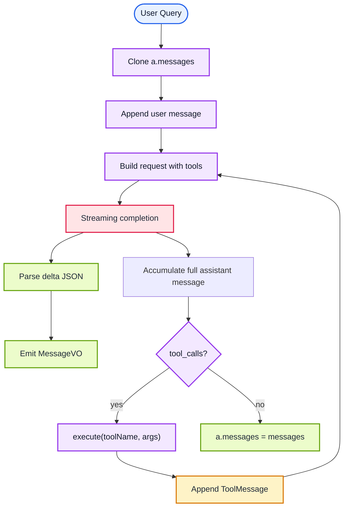

```mermaid
flowchart TD
    classDef entry fill:#e8f1ff,stroke:#2563eb,stroke-width:2px,color:#0f172a;
    classDef orchestration fill:#f3e8ff,stroke:#9333ea,stroke-width:2px,color:#111827;
    classDef domain fill:#ecfccb,stroke:#65a30d,stroke-width:2px,color:#1f2937;
    classDef data fill:#fef3c7,stroke:#d97706,stroke-width:2px,color:#1f2937;
    classDef external fill:#ffe4e6,stroke:#e11d48,stroke-width:2px,color:#1f2937;

    Query([User Query]) --> Clone["Clone a.messages"]
    Clone --> Append["Append user message"]
    Append --> Request["Build request with tools"]
    Request --> LLM["Streaming completion"]
    LLM --> Parse["Parse delta JSON"]
    Parse --> Emit["Emit MessageVO"]
    LLM --> Full["Accumulate full assistant message"]
    Full --> Calls{"tool_calls?"}
    Calls -- "yes" --> Exec["execute(toolName, args)"]
    Exec --> ToolResult["Append ToolMessage"]
    ToolResult --> Request
    Calls -- "no" --> Save["a.messages = messages"]

    class Query entry;
    class Clone,Append,Request,Calls,Exec orchestration;
    class Parse,Emit,Save domain;
    class ToolResult data;
    class LLM external;

```