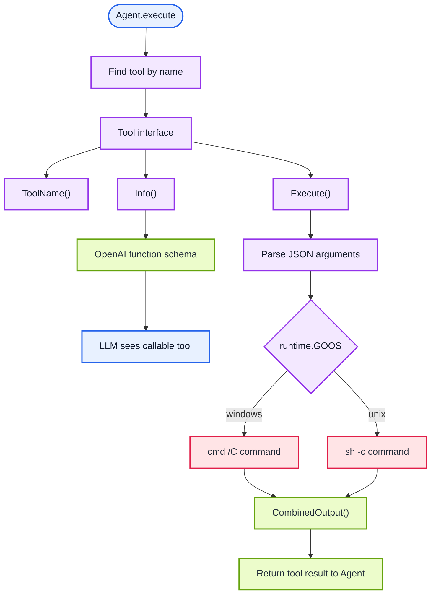

```mermaid
flowchart TD
    classDef entry fill:#e8f1ff,stroke:#2563eb,stroke-width:2px,color:#0f172a;
    classDef orchestration fill:#f3e8ff,stroke:#9333ea,stroke-width:2px,color:#111827;
    classDef domain fill:#ecfccb,stroke:#65a30d,stroke-width:2px,color:#1f2937;
    classDef external fill:#ffe4e6,stroke:#e11d48,stroke-width:2px,color:#1f2937;

    Agent([Agent.execute]) --> Lookup["Find tool by name"]
    Lookup --> ToolIface["Tool interface"]
    ToolIface --> Name["ToolName()"]
    ToolIface --> Info["Info()"]
    ToolIface --> Exec["Execute()"]

    Info --> Schema["OpenAI function schema"]
    Schema --> LLM["LLM sees callable tool"]

    Exec --> Parse["Parse JSON arguments"]
    Parse --> Branch{"runtime.GOOS"}
    Branch -- "windows" --> Cmd["cmd /C command"]
    Branch -- "unix" --> Sh["sh -c command"]
    Cmd --> Output["CombinedOutput()"]
    Sh --> Output
    Output --> Result["Return tool result to Agent"]

    class Agent,LLM entry;
    class Lookup,ToolIface,Name,Info,Exec,Parse,Branch orchestration;
    class Schema,Output,Result domain;
    class Cmd,Sh external;

```