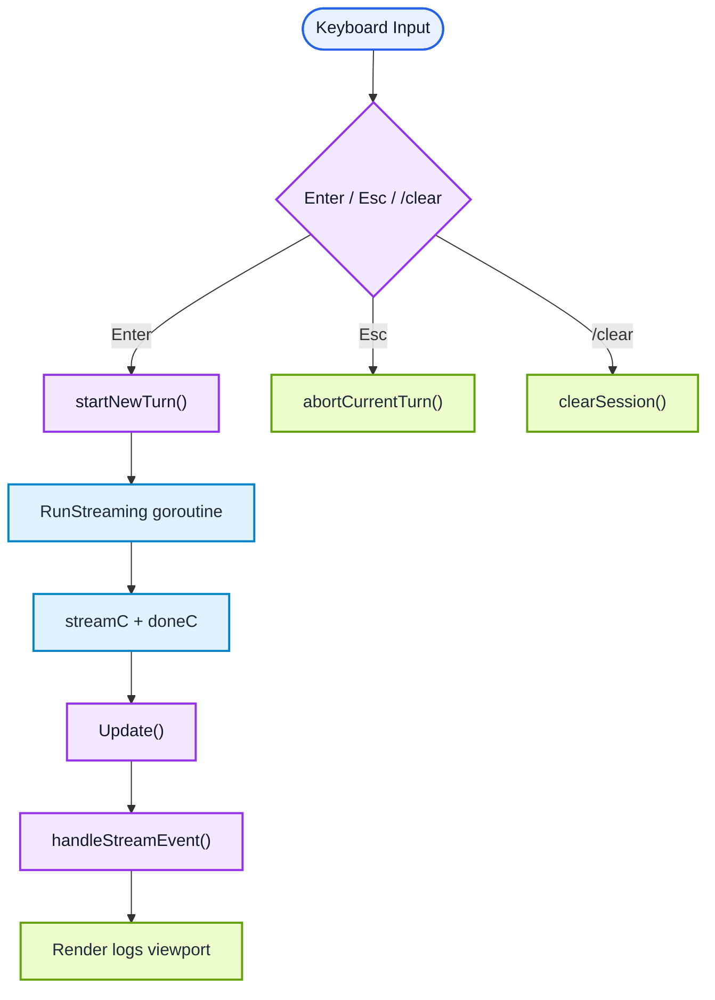

```mermaid
flowchart TD
    classDef entry fill:#e8f1ff,stroke:#2563eb,stroke-width:2px,color:#0f172a;
    classDef orchestration fill:#f3e8ff,stroke:#9333ea,stroke-width:2px,color:#111827;
    classDef domain fill:#ecfccb,stroke:#65a30d,stroke-width:2px,color:#1f2937;
    classDef async fill:#e0f2fe,stroke:#0284c7,stroke-width:2px,color:#1f2937;

    Input([Keyboard Input]) --> Submit{"Enter / Esc / /clear"}
    Submit -- "Enter" --> Start["startNewTurn()"]
    Start --> Goroutine["RunStreaming goroutine"]
    Goroutine --> Channel["streamC + doneC"]
    Channel --> Update["Update()"]
    Update --> Handle["handleStreamEvent()"]
    Handle --> Render["Render logs viewport"]
    Submit -- "Esc" --> Abort["abortCurrentTurn()"]
    Submit -- "/clear" --> Clear["clearSession()"]

    class Input entry;
    class Submit,Start,Update,Handle orchestration;
    class Render,Abort,Clear domain;
    class Goroutine,Channel async;

```