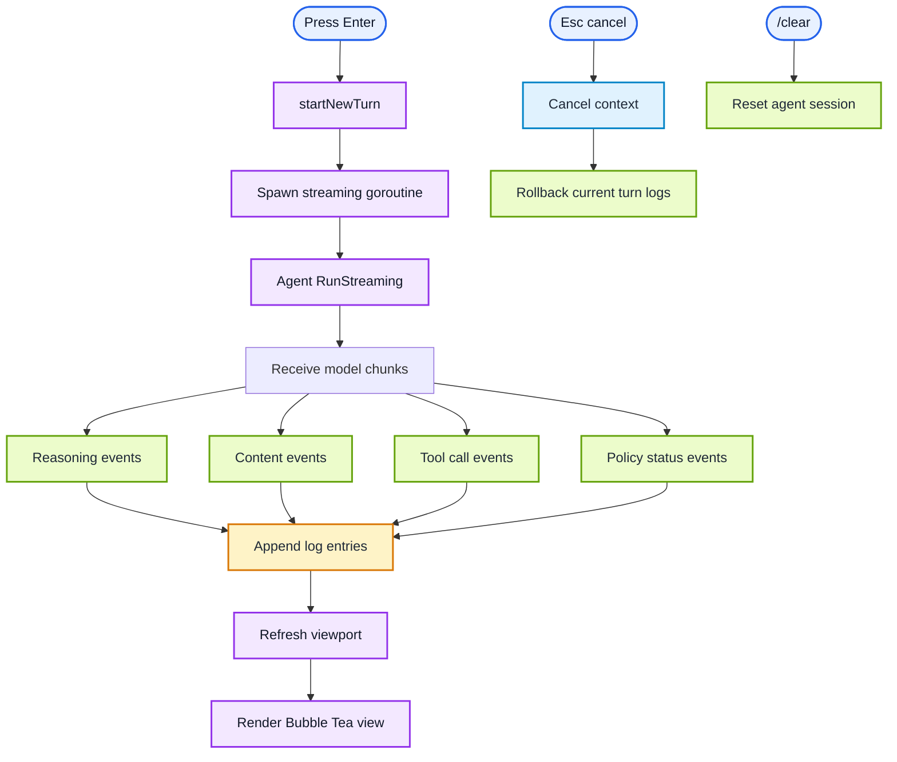
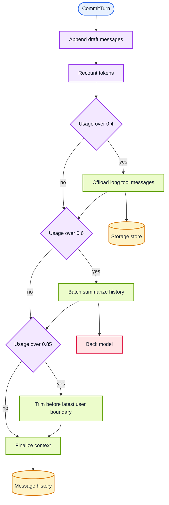
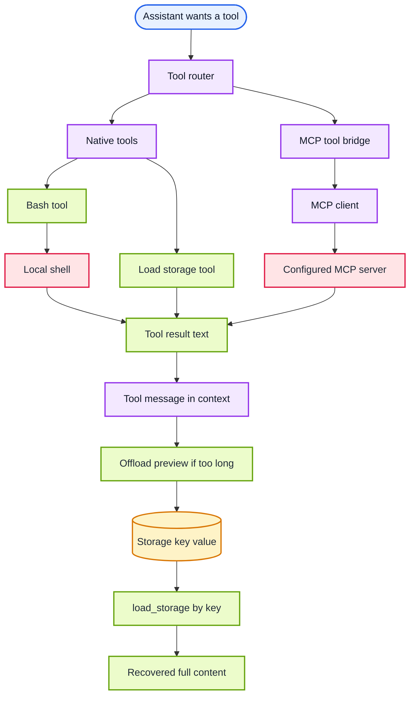

```mermaid
flowchart TD
    classDef entry fill:#e8f1ff,stroke:#2563eb,stroke-width:2px,color:#0f172a;
    classDef orchestration fill:#f3e8ff,stroke:#9333ea,stroke-width:2px,color:#111827;
    classDef domain fill:#ecfccb,stroke:#65a30d,stroke-width:2px,color:#1f2937;
    classDef data fill:#fef3c7,stroke:#d97706,stroke-width:2px,color:#1f2937;
    classDef external fill:#ffe4e6,stroke:#e11d48,stroke-width:2px,color:#1f2937;
    classDef async fill:#e0f2fe,stroke:#0284c7,stroke-width:2px,color:#1f2937;

    User([User query]) --> TUI[TUI model]
    TUI --> Agent[RunStreaming turn]
    Agent --> ContextReq[Build request context]
    ContextReq --> FrontLLM[Front model]
    FrontLLM --> Assist[Assistant delta stream]
    Assist --> TUI
    FrontLLM --> ToolCall[Tool call request]
    ToolCall --> ToolExec[Execute native or MCP tool]
    ToolExec --> ToolMsg[Append tool message]
    ToolMsg --> FrontLLM
    Assist --> Commit[Commit turn]
    Commit --> PolicyPipe[Apply context policies]
    PolicyPipe --> Offload[Offload long tool output]
    PolicyPipe --> Summarize[Summarize old history]
    PolicyPipe --> Truncate[Trim old messages]
    Offload --> Store[(Memory storage)]
    Summarize --> BackLLM[Back model summarizer]
    PolicyPipe --> ContextState[(Managed message history)]
    ContextState --> ContextReq

    class User,TUI entry;
    class Agent,ContextReq,Commit,PolicyPipe orchestration;
    class Assist,Offload,Summarize,Truncate,ToolExec,ToolMsg domain;
    class Store,ContextState data;
    class FrontLLM,BackLLM external;
    class ToolCall async;
```






