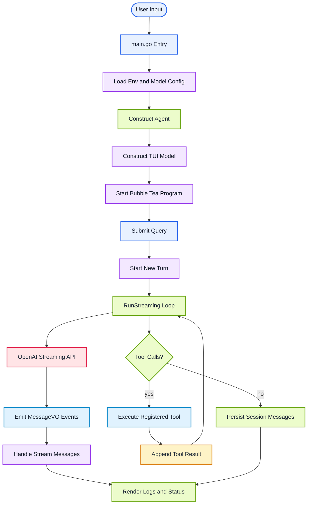
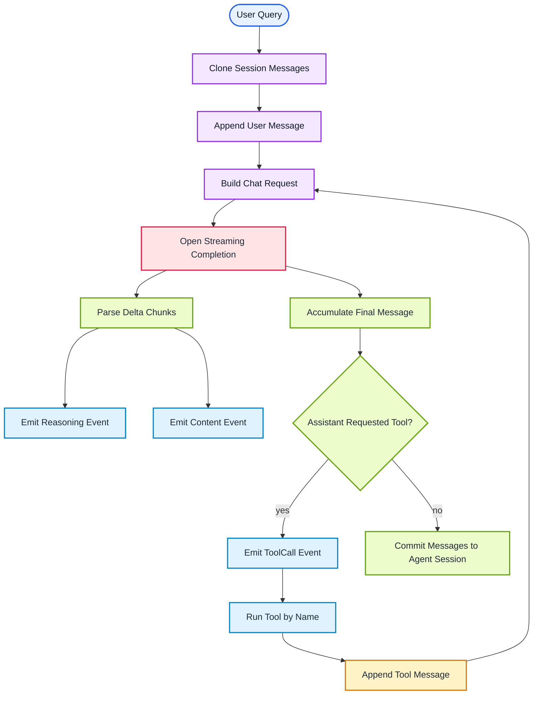
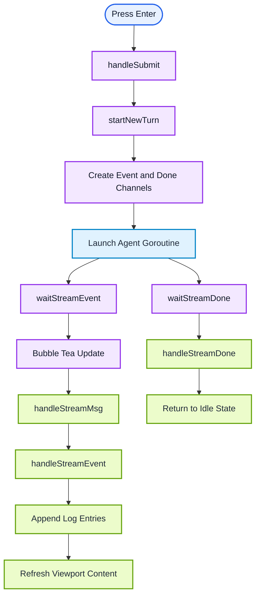

```mermaid
flowchart TD
    classDef entry fill:#e8f1ff,stroke:#2563eb,stroke-width:2px,color:#0f172a;
    classDef orchestration fill:#f3e8ff,stroke:#9333ea,stroke-width:2px,color:#111827;
    classDef domain fill:#ecfccb,stroke:#65a30d,stroke-width:2px,color:#1f2937;
    classDef data fill:#fef3c7,stroke:#d97706,stroke-width:2px,color:#1f2937;
    classDef external fill:#ffe4e6,stroke:#e11d48,stroke-width:2px,color:#1f2937;
    classDef async fill:#e0f2fe,stroke:#0284c7,stroke-width:2px,color:#1f2937;

    User([User Input]) --> Main[main.go Entry]
    Main --> Config[Load Env and Model Config]
    Config --> BuildAgent[Construct Agent]
    BuildAgent --> BuildTUI[Construct TUI Model]
    BuildTUI --> Program[Start Bubble Tea Program]
    Program --> Submit[Submit Query]
    Submit --> Turn[Start New Turn]
    Turn --> StreamLoop[RunStreaming Loop]
    StreamLoop --> LLM[OpenAI Streaming API]
    LLM --> Events[Emit MessageVO Events]
    Events --> TUIConsume[Handle Stream Messages]
    TUIConsume --> Render[Render Logs and Status]
    StreamLoop --> ToolCheck{Tool Calls?}
    ToolCheck -->|yes| ToolExec[Execute Registered Tool]
    ToolExec --> ToolOut[Append Tool Result]
    ToolOut --> StreamLoop
    ToolCheck -->|no| SaveState[Persist Session Messages]
    SaveState --> Render

    class User,Main,Submit entry;
    class Config,BuildTUI,Program,Turn,TUIConsume orchestration;
    class BuildAgent,StreamLoop,ToolCheck,SaveState,Render domain;
    class ToolOut data;
    class LLM external;
    class Events,ToolExec async;
```

```mermaid
flowchart TD
    classDef entry fill:#e8f1ff,stroke:#2563eb,stroke-width:2px,color:#0f172a;
    classDef orchestration fill:#f3e8ff,stroke:#9333ea,stroke-width:2px,color:#111827;
    classDef domain fill:#ecfccb,stroke:#65a30d,stroke-width:2px,color:#1f2937;
    classDef data fill:#fef3c7,stroke:#d97706,stroke-width:2px,color:#1f2937;
    classDef external fill:#ffe4e6,stroke:#e11d48,stroke-width:2px,color:#1f2937;
    classDef async fill:#e0f2fe,stroke:#0284c7,stroke-width:2px,color:#1f2937;

    Query([User Query]) --> Session[Clone Session Messages]
    Session --> AppendUser[Append User Message]
    AppendUser --> Request[Build Chat Request]
    Request --> Stream[Open Streaming Completion]
    Stream --> Delta[Parse Delta Chunks]
    Delta --> Reasoning[Emit Reasoning Event]
    Delta --> Content[Emit Content Event]
    Stream --> Finish[Accumulate Final Message]
    Finish --> NeedTool{Assistant Requested Tool?}
    NeedTool -->|yes| ToolEvent[Emit ToolCall Event]
    ToolEvent --> Execute[Run Tool by Name]
    Execute --> ToolMsg[Append Tool Message]
    ToolMsg --> Request
    NeedTool -->|no| Commit[Commit Messages to Agent Session]

    class Query entry;
    class Session,AppendUser,Request orchestration;
    class Delta,Finish,NeedTool,Commit domain;
    class ToolMsg data;
    class Stream external;
    class Reasoning,Content,ToolEvent,Execute async;
```

```mermaid
flowchart TD
    classDef entry fill:#e8f1ff,stroke:#2563eb,stroke-width:2px,color:#0f172a;
    classDef orchestration fill:#f3e8ff,stroke:#9333ea,stroke-width:2px,color:#111827;
    classDef domain fill:#ecfccb,stroke:#65a30d,stroke-width:2px,color:#1f2937;
    classDef data fill:#fef3c7,stroke:#d97706,stroke-width:2px,color:#1f2937;
    classDef external fill:#ffe4e6,stroke:#e11d48,stroke-width:2px,color:#1f2937;
    classDef async fill:#e0f2fe,stroke:#0284c7,stroke-width:2px,color:#1f2937;

    Enter([Press Enter]) --> Submit[handleSubmit]
    Submit --> Turn[startNewTurn]
    Turn --> Channels[Create Event and Done Channels]
    Channels --> Worker[Launch Agent Goroutine]
    Worker --> WaitEvent[waitStreamEvent]
    WaitEvent --> Update[Bubble Tea Update]
    Update --> StreamMsg[handleStreamMsg]
    StreamMsg --> EventMap[handleStreamEvent]
    EventMap --> Logs[Append Log Entries]
    Logs --> View[Refresh Viewport Content]
    Worker --> Done[waitStreamDone]
    Done --> Finish[handleStreamDone]
    Finish --> Idle[Return to Idle State]

    class Enter entry;
    class Submit,Turn,Channels,WaitEvent,Update,Done orchestration;
    class StreamMsg,EventMap,Logs,View,Finish,Idle domain;
    class Worker async;
```
